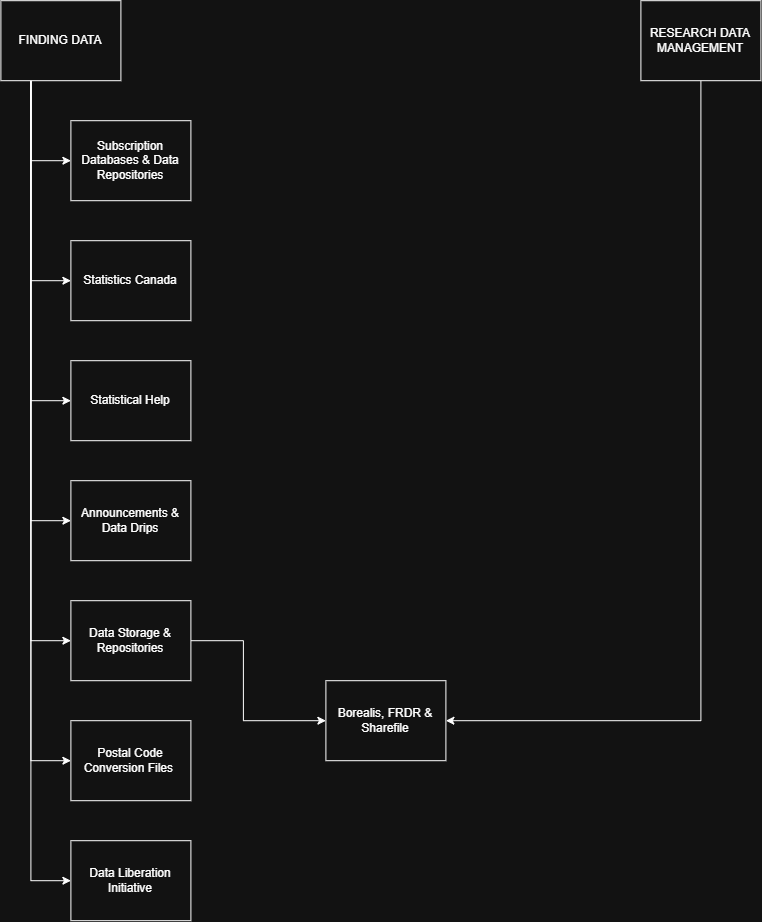
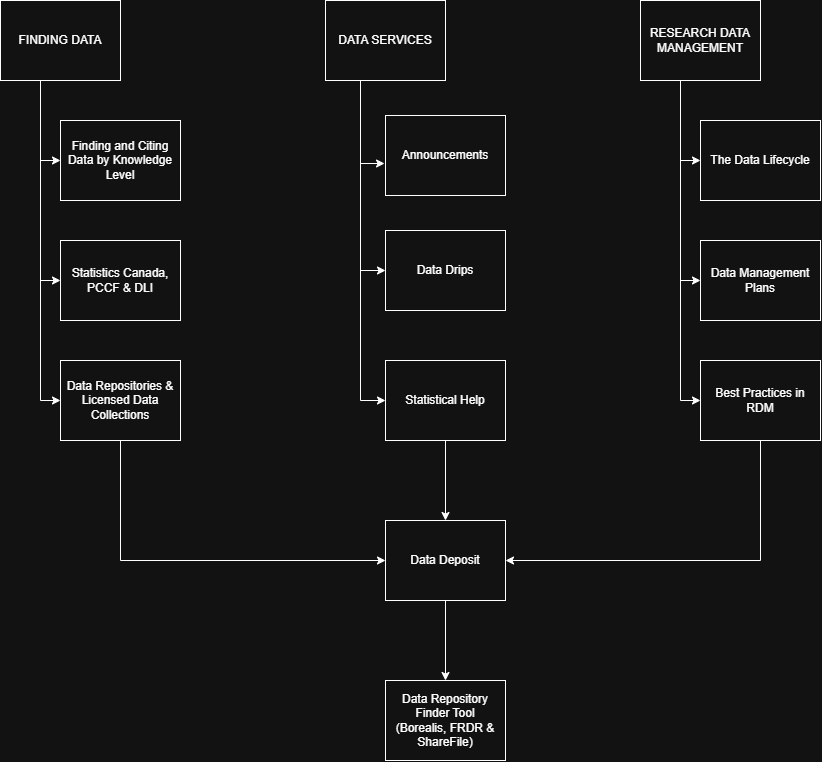
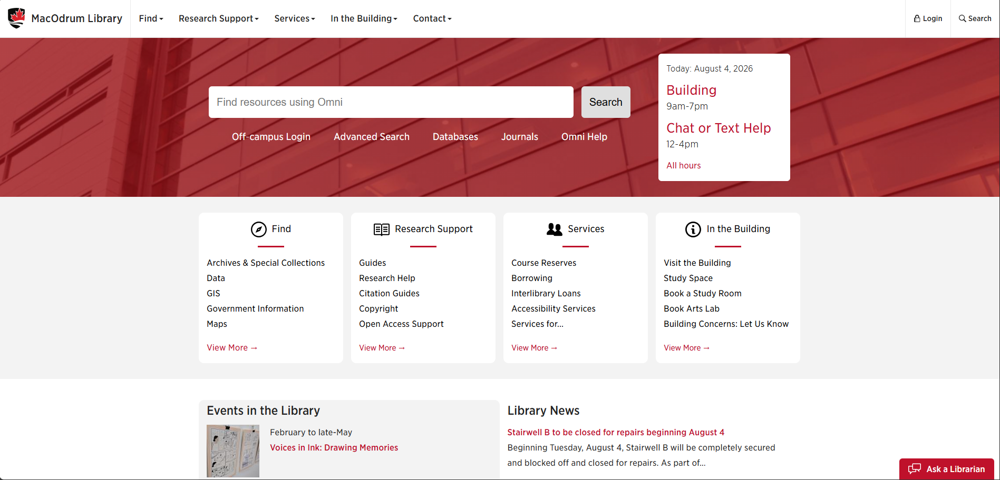

<!-- .slide: data-transition="none-in slide-out" class="title-slide" -->
# The New* Data Pages

*not everything is new*

Alp Ozturk  
August 13th, 2026

---
<!-- .slide: data-transition="none-in slide-out" -->
# Land Acknowledgement

We respectfully acknowledge the Algonquin Nation, whose traditional and unceded territory we are gathered upon today.

---
<!-- .slide: data-transition="none-in slide-out" class="left-align" -->
# Data Drips Special Topics Sessions

- Final Special Topic Data Drip for the Summer!
- Slide URLs will be shared via email.

---
<!-- .slide: data-transition="none-in slide-out" class="left-align" -->
# Agenda

- "The Data Pages" Spring/Summer project
- Look at the pages!
- Reveal.js
- What's next for Data Drips?

---
<!-- .slide: data-transition="none-in slide-out" -->
# Contact

dataservices@carleton.ca

---
<!-- .slide: data-transition="none-in slide-out" class="left-align" -->
# Data Pages Project

- Redesign and reorganize data & research data management content
- Team of 3
  - Alp: Data, Data Deposit and Data Services content
  - Heather: Research Data Management (RDM), Data Lifecycle & Data Management Plans (DMP) content
  - Betsy: Data content, design & language support
- Shout out to Shelley for Drupal support!

---
<!-- .slide: data-transition="none-in slide-out" class="left-align" -->
# Data Pages Project (Continued)

- Catalogued all the data & RDM pages
- Used Notebook LLM to best disperse content across fields
- Much of the content already existed
  - Just scattered across pages and presentations
- Design & language focused
- Broke content down with focus on:
  - Functional use
  - Service provision
  - Research support

---
<!-- .slide: data-transition="none-in slide-out" -->

 </img>

--- 
<!-- .slide: data-transition="none-in slide-out" -->

 </img>

---
<!-- .slide: data-transition="none-in slide-out" -->

<a href = "https://library.carleton.ca/">
 </img> </a>

---
<!-- .slide: data-transition="none-in slide-out" class="left-align" -->
# Reveal.js

- Excellent for content in packages
- Markdown & HTML are more machine-readable and lightweight than PPTX
- This presentation hosted on GitHub
- Customizable
- Workflow:
  - Built the slide deck in PowerPoint
  - Had Copilot convert information to Markdown

---
<!-- .slide: data-transition="none-in slide-out" class="left-align" -->
# What's Next for Data Drips?...

## Fall 2026

- Data Services
- Finding Data
- Introduction to Research Data Management & the Data Lifecycle
- Data Management Plans
- Data Deposit
- Depositing Data in Borealis
- Best Practices in Research Data Management
- Folder Directories (In Progress)
--- 
<!-- .slide: data-transition="none-in slide-out" class="left-align" -->
# ...What's Next for Data Drips?
## Winter 2027

- Introduction to Research Data Management & the Data Lifecycle
- Data Management Plans
- Data Deposit
- Depositing Data in Borealis
- Best Practices in Research Data Management
- Folder Directories (In Progress)
- Data Privacy (In Progress)
- Data Anonymization (In Progress)

---
<!-- .slide: data-transition="none-in slide-out" -->
# Thank You!

- **dataservices@carleton.ca**
